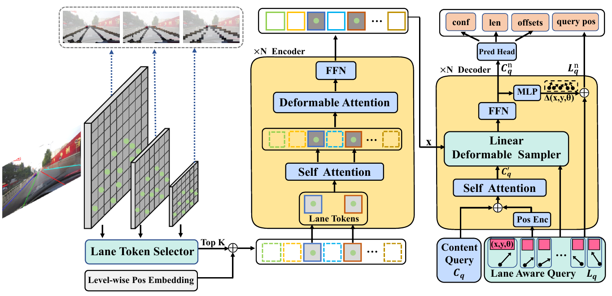

## Our paper is now available!
You can access it [here](https://ieeexplore.ieee.org/document/10954269).😊
```
@ARTICLE{10954269,
  author={Liu, Binhui and Ling, Qiang},
  journal={IEEE Transactions on Intelligent Transportation Systems}, 
  title={Sparse LaneFormer: End-to-End Lane Detection With Sparse Proposals and Interactions}, 
  year={2025},
  volume={},
  number={},
  pages={1-14},
  keywords={Lane detection;Feature extraction;Proposals;Decoding;Pedestrians;Object detection;Accuracy;Transformers;Polynomials;Annotations;End-to-end lane detection;sparse design;lane aware query;transformer;deformable attention},
  doi={10.1109/TITS.2025.3555220}}
```
# Sparse LaneFormer
This repo is the PyTorch implementation for Sparse LaneFormer.

We propose a fully sparse end-to-end lane detection framework called Sparse LaneFormer, which incorporates both sparse proposals and interactions. Specifically, we introduce a Lane Aware Query (LAQ) as sparse lane proposals, which can predict learnable and explicit lane positions. Additionally, we introduce  a Lane Token Selector (LTS) and a Linear Deformable Sampler (LDS) to establish sparse interactions among lane tokens. The LTS selectively updates sparse lane tokens in the encoder, while in the decoder, LDS extracts discriminative lane representations from global feature maps by sampling lane features along the LAQ. By focusing on the most informative tokens, Sparse LaneFormer achieves state-of-the-art performance with only 10\% of encoder tokens, resulting in an 80\% reduction in overall computational cost compared to its dense counterpart. 

## Installation
   1. Clone this repo
   ```sh
   git clone https://github.com/ustclbh/Sparse-LaneFormer.git
   cd Sparse-LaneFormer
   ```

   2. Install Pytorch and torchvision
   ```sh
  conda create -n sparself python=3.7 -y
  conda activate  sparself 
  conda install pytorch==1.12.1 torchvision==0.7.0 cudatoolkit=10.2 -c pytorch -y
   ```

   3. Install other needed packages
   ```sh
   pip install -r requirement.txt
   # Note: Only tested with mmdet=2.28.2,mmcv=1.7.1.  If you meet errors, please refer to mmdetection repo for more details
   ```
   
   4. Fix errors caused by PReLU in MMCV
   ```sh
   vim /path/mmcv/cnn/bricks/transformer.py
   ```
   Then, following [pull request in MMCV](https://github.com/open-mmlab/mmcv/pull/2444/commits/4290c68f653f63e96f022f330ceb71b578ee602d) to solve this problem.

   5. Compiling CUDA operators for deformable attention
   ```sh
   cd dnlane/models/ops
   python setup.py build install
   # unit test (should see all checking is True)
   python test.py
   cd ../../..
   ```
    
## Dataset
Download datasets and put it into `[data-path]` folder. And edit the `data_root` in the config file to your dataset path.

### CULane
[\[CULane website\]](https://xingangpan.github.io/projects/CULane.html)
[\[Download\]](https://drive.google.com/drive/folders/1mSLgwVTiaUMAb4AVOWwlCD5JcWdrwpvu)


The directory structure should be like follows:
```
[data-path]/culane
├── laneseg_label_w16
├── driver_23_30frame
├── driver_37_30frame
├── driver_100_30frame
├── driver_161_90frame
├── driver_182_30frame
├── driver_193_90frame
└── list
    └── test_split
    |   ├── test0_normal.txt
    |   ├── test1_crowd.txt
    |   ├── test2_hlight.txt
    |   ├── test3_shadow.txt
    |   ├── test4_noline.txt
    |   ├── test5_arrow.txt
    |   ├── test6_curve.txt
    |   ├── test7_cross.txt
    |   └── test8_night.txt
    └── train.txt
    └── test.txt
    └── val.txt

```
### TuSimple
[\[TuSimple website\]](https://github.com/TuSimple/tusimple-benchmark/tree/master/doc/lane_detection)
[\[Download\]](https://github.com/TuSimple/tusimple-benchmark/issues/3)

For Tusimple, the segmentation annotation is not provided, hence we need to generate segmentation from the json annotation.
```
python dnlane/datasets/generate_seg_tusimple.py --root $TUSIMPLEROOT
# this will generate seg_label directory
```

The directory structure should be like follows:
```
[data-path]/tusimple
├── clips
├── label_data_0313.json
├── label_data_0531.json
├── label_data_0601.json
├── label_data_0601.json
├── test_label.json
├── test_baseline.json
└── seg_label
```
## Evaluation

### CULane
|   Backbone    |  F1   | Weights                                                                                                          |  Config| Training log|
|:-------------:|:-----:|------------------------------------------------------------------------------------------------------------------|-----|-----|
|   SwinBase  | 79.6 | [sparself_culane_swinb.pth](https://drive.google.com/file/d/1vbA1yH0BhAAvuAxQPxXeZh-OQGdl4mik/view?usp=drive_link)  |[culane_swinb.py](https://drive.google.com/file/d/1AL3tWA0sEGELyO8s5q_cTK08IjE8mvhp/view?usp=drive_link) |  [log](https://drive.google.com/file/d/1pA8LzlyfNo8xWDODuuOxIntBJRqzk8JQ/view?usp=drive_link)|


To evalute the model, download the corresponding weights and configs file  and run the following commands.
```shell
bash eval.sh  /path/to/your/config /path/to/your/checkpoint
```


## Training
```shell
if you have multiple gpus:
CUDA_VISIBLE_DEVICES=0,1,2,3   bash dist_train.sh  /path/to/your/config 4

otherwise:
bash run.sh /path/to/your/config

   # Note: We set training epoch to 50 and use an early stop at 30th epoch.
```

## Acknowledgement
* Our code is constructed based on [O2SFormer](https://github.com/zkyseu/O2SFormer/tree/main), [CLRNet](https://github.com/Turoad/CLRNet) and [DAB-DETR](https://github.com/IDEA-Research/DAB-DETR). Thanks for their excellent work!
